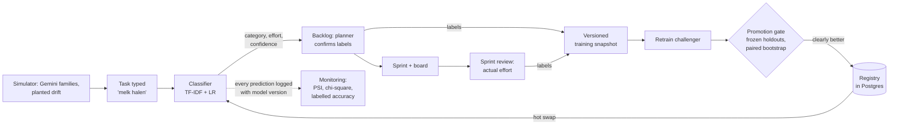
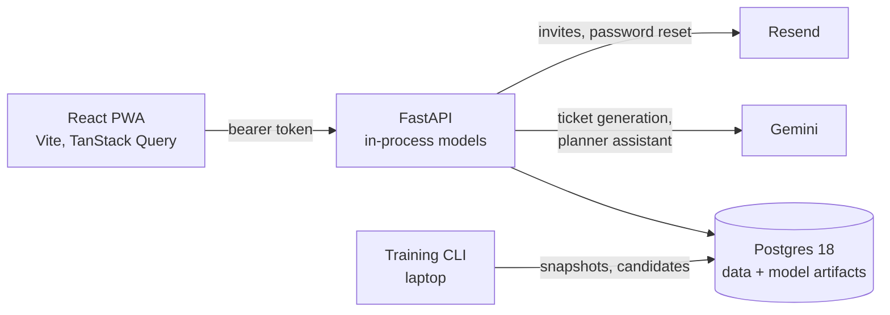

# Family Scrum (Gezinsbord)

A household task board for families, run as weekly **Scrum sprints**, with a
**machine-learning model that is trained, versioned, monitored for drift and retrained**.

My family uses it for real: tasks go in, a classifier predicts their category and effort, we
plan a weekly sprint, and the sprint review records how big each task *really* was. That
review is the ground truth the model learns from. A simulator runs the whole app for
LLM-generated families, so the full ML lifecycle can be demonstrated with drift planted at a
known week.

Built as a portfolio project to learn **classical ML and MLOps** from first principles. Every ML
step has a written lesson in [docs/learning/](docs/learning/), including the experiments that
failed.

**Live**: [the app](https://ideal-achievement-production-6b63.up.railway.app) (Dutch UI,
installable PWA) · API on Railway · ~150 backend tests

**Contents**: [The app](#the-app-a-family-planner) ·
[Scrum at home](#scrum-at-home) · [Machine learning](#machine-learning) ·
[Results](#what-the-experiments-showed) · [Architecture](#architecture) ·
[Run it](#run-it-locally) · [Documents](#documents)

---

## The app: a family planner

A mobile-first PWA in Dutch (dark theme, pink-purple accents), installable on a phone's home
screen. Each family has its own private board; families never see each other's data.

### Who does what

| Role | Can |
|---|---|
| **Planner** (a parent) | confirm labels, plan sprints, assign tasks, move any card, invite members |
| **Reviewer** | review finished sprints (was it done, how big was it really) |
| **Member** (incl. children) | add tasks, move *their own* cards on the board |

Children are members too (`is_child`); it matters for privacy (names are masked as
"naamkind") and for planning (children have less time and can't do every kind of task).

### The screens

| Screen | What happens |
|---|---|
| **Nieuw** | Type a task ("melk halen", "dakgoot schoonmaken"), optionally a due date. The model immediately predicts its category and effort. |
| **Backlog** | Every open task with the model's guess. Uncertain guesses (confidence below 0.8) are dashed with a "?" and listed under *Te controleren*. Tap a task to confirm or correct category and effort; edit or delete it. |
| **Plannen** | Create the week's sprint and pull tasks in, each with an assignee. Two helpers: **"Eerder gedaan"** shows similar tasks the family did before (who, how big it really was, finished or not), and **"Voorstel maken"** asks the Planner Assistant for a draft sprint to accept item by item. |
| **Bord** | The kanban board: *Te doen → Bezig → Klaar*, drag and drop on desktop and phone. |
| **Review** | For each task: finished? how big was it really? Then close the sprint; unfinished tasks return to the backlog. |
| **Gezin** | Members and roles; invite by email (the invite link handles sign-up and joining). |
| **Beheer** (platform admin) | Demo families, simulations, and the model-monitoring dashboard. |

Accounts: email + password with verification and password reset (Google sign-in is wired but
not yet enabled). Email goes through Resend; the app works without it in development.

---

## Scrum at home

The app maps the Scrum cycle onto a family week. Each step also produces data for the model:

| Scrum | In the app | What the model gets out of it |
|---|---|---|
| Product backlog | Tasks anyone in the family adds | A prediction per task, logged with its model version |
| Backlog refinement | The planner confirms or corrects category and effort | **Labelling point 1**: the planner's label, plus whether they changed the model's guess |
| Sprint planning | Planner picks tasks and assignees for the week (optionally from the assistant's proposal) | Who was asked to do what |
| Sprint | The board, each member moving their own cards | Status changes with timestamps |
| Sprint review | Was it finished? How big was it *really*? | **Labelling point 2**: the actual effort, the most reliable label in the system |
| Retrospective | Sprint notes; unfinished work returns to the backlog | History for "Eerder gedaan" and for the planners |

Effort is the story-point equivalent: **Klein** (small, up to 30 min), **Middel** (medium,
30 min to 2 h), **Groot** (large, more than 2 h). The gap between the estimate at planning and
the actual effort at review is exactly what the effort model tries to learn.

---

## Machine learning

### The lifecycle



### Two prediction tasks

- **Category** (7 classes): huishouden (chores), boodschappen (groceries), kinderen (kids),
  klussen & onderhoud (home maintenance), financiën (finance), sociaal (social), overig (other).
  Label definitions: [docs/labeling-guidelines.md](docs/labeling-guidelines.md).
- **Effort** (3 ordered classes): S < M < L.

### Data

- **Synthetic families.** Gemini generates Dutch tasks for configurable demo families
  (members, ages, pets, house, garden, car). Each task comes with the category and effort the
  generator intended: **weak labels**, useful for bootstrapping and clearly marked as such.
  Generation is token-capped, and duplicates and invalid outputs are rejected and counted.
- **Real data**: the developer's own family, entered through the app.
- **Provenance on every row.** Tasks and predictions carry `source` = `real` | `simulated`
  (derived from the household, never chosen by the caller); every metric is reported per source.
- **Training eligibility.** Only households flagged `training_eligible` feed training (the demo
  families and the developer's family); simulation runs and other families never do.
- **Label priority for effort**: the sprint-review actual > the planner's confirmed estimate >
  the generator's weak label. Every training row records which one it used.
- **Snapshots.** Each training run reads a frozen Parquet snapshot with a content hash and the
  household member lists, so "what did model v2 learn from?" always has an exact answer.

### Text preprocessing (shared by training and serving)

- **Role-token masking**: household members' names are replaced by `naamkind` / `naamouder`, so
  the model learns "a child's name → probably kids" instead of "Lieke → kids", which only works
  in one family. The same function runs in training and serving; each model declares the
  preprocessing it expects (`role-mask-v1`), and serving refuses a model whose preprocessing it
  doesn't know (no training/serving skew).
- **Normalisation** (lowercase, accents, punctuation) for duplicate detection.

### Models

| | Category | Effort |
|---|---|---|
| Features | TF-IDF word 1–2-grams + character 2–5-grams within words (`char_wb`), sublinear TF | same |
| Classifier | Logistic regression, C = 1, balanced class weights | **Ordinal** (Frank & Hall): two binary LRs, "bigger than S?" and "bigger than M?", combined into P(S), P(M), P(L) |
| Calibration | Temperature scaling, fitted on out-of-fold predictions | same |
| Baselines | Majority class; ~20 hand-written keyword rules | Majority class |

Character n-grams handle Dutch compounds and typos ("vaatwasser", "boodschapen"). The ordinal
model knows L is "more" than M, which plain multiclass doesn't. **Temperature scaling** makes
confidence honest (0.8 should be right ~80% of the time), because the UI only pre-fills
confident predictions and flags the rest for review; calibration is checked with the expected
calibration error (ECE) before and after.

Everything is an sklearn estimator in a `Pipeline`, so cross-validation, pickling and serving
work the same way.

### Evaluation

- **Group k-fold cross-validation by household** (3 folds): tasks from one family share
  names, phrasing and habits, so a random split would measure memorisation.
- **Frozen holdouts**: manifests of topic IDs + labels committed to git and never edited (a
  hook blocks edits): `holdout-sim-v1` (unseen synthetic families) and `holdout-drift-v1` (an
  unseen simulated world after a concept drift, labelled with the simulator's hidden truth).
- **Near-duplicate exclusion**: LLM-generated data repeats itself, so training rows with a
  character-n-gram cosine similarity ≥ 0.9 to any holdout text are dropped, checked on raw *and*
  on masked text.
- **Metrics**: macro-F1 (classes are imbalanced; accuracy hides a model that ignores rare
  classes) with a bootstrap 95% interval; per-class precision/recall; for effort the ordinal
  MAE (S→L counts as two steps wrong) and recall on L; accuracy per true category; per source.
- **Model selection without the test set**: hyperparameters are chosen by group CV on training
  families only (`ml.train --cv-only`); holdouts are touched once, for the final comparison.

### Registry, versioning and serving

- A `ModelVersion` table (task, status, training-data hash and size, metrics per holdout and
  per source, parent version, notes) and artifacts stored as joblib bytes in Postgres, with
  metadata (scikit-learn version, preprocessing, config, snapshot, git commit). Loading checks
  the sha256 and refuses a different scikit-learn minor version. See
  [ADR-002](docs/decisions/002-model-registry.md): it maps 1:1 onto MLflow.
- Statuses: `candidate` → `active` (one per task) → `retired`, or `rejected`.
- Models are served in-process by FastAPI with a cache; a promotion is picked up without a
  redeploy.
- **Predictions are append-only** and always carry their `model_version_id`, so every metric
  can be attributed to the exact model that made it. A model that fails to load or predict is
  skipped: the task is still created, just flagged for review.

### Retraining and the promotion gate

1. Snapshot the labelled data (`ml.retrain snapshot`).
2. Train challengers; evaluate challenger, champion and baselines on **every** frozen holdout.
3. **Gate**: the challenger is promoted only if it is *clearly better* on the primary holdout
   (today's world: the 95% interval of the paired-bootstrap difference in macro-F1 lies above
   zero), *not clearly worse* on any other holdout, and not worse on real-data rows.
4. **Shadow evaluation**: the simulator replays an unseen world with the candidate pinned, next
   to the champion's replay, while nothing changes for real families.
5. Promote only with explicit human approval; **rollback** re-activates the parent version in
   one transaction.

Options for the sim-to-real problem: weight real rows more than synthetic ones, and weight
review labels (measured) more than estimates.

### Monitoring and drift detection

Computed from the prediction log, per window of weeks, against a reference (the model's
holdout profile, or the first weeks after deployment):

| Signal | Test | Alarm when |
|---|---|---|
| Category mix, confidence, text length (no labels needed) | PSI **and** chi-square | PSI > 0.25 and p < 0.01, window ≥ 30 tasks |
| Category and effort accuracy (needs labels) | Wilson 95% interval | the whole interval is below the reference, ≥ 15 labelled tasks |
| Effort accuracy per category | one-sided two-proportion z-test vs. earlier weeks | p < 0.01 / 7 (Bonferroni), enough tasks on both sides |

Alarms are counted at their **onset** (a detector that keeps firing is one detection). The
admin dashboard plots all of this per week with the planted events as markers, a segments
table, and a log of which model version served which weeks. Data drift (new kinds of tasks, a
child starting to type) shows in the label-free signals; **concept drift** (the same task now
takes longer) only shows in labelled accuracy, which is why the sprint review matters.

### The simulator

Runs the **real app services** week by week on a simulated clock, for a simulated family:

- **World model**: seasons (garden work in summer, school in September, presents in December)
  and scenario events at known weeks: a dog arrives (week 8), groceries start taking longer
  after a move (week 12, concept drift), an 8-year-old starts typing tasks (week 16).
- **Hidden truth**: every simulated task has a true category and effort the app never sees, so
  accuracy can be measured exactly.
- **A simulated planner** that labels with configurable care: how many tasks it checks, how
  often it rubber-stamps confident predictions, and its honest error rate (to study
  automation bias).
- **Deterministic replays**: the Gemini ticket pool is generated once; replays with the same
  seed are identical and free. Replays can pin candidate model versions (shadow evaluation).
- **Load work model** (for planner experiments): every person has weekly hours; overloaded or
  unsuited assignments are less likely to get done; every random event is keyed by task, week
  and purpose (**common random numbers**), so two planners face the same luck.

### Per-household adaptation

A global model can't know that *this* family's groceries got bigger after a move. A
**label-shift correction** (Bayes' rule) re-weights effort predictions per household and
category, from that family's last 10 reviews: p_adj(e) ∝ p_model(e) × π_household(e) /
π_model(e), with the household's distribution smoothed by 4 pseudo-counts and applied only
after 3 reviews. The raw model output is always kept next to the adjusted one. Built and
evaluated in shadow; switched off in production until tuned.

### Similar tasks ("Eerder gedaan")

For each backlog task, the most similar earlier, reviewed tasks of the same family: TF-IDF
character n-grams fitted per query on that task plus the family's reviewed tasks, cosine
similarity, shown above a threshold of 0.3 (~90% of shown neighbours are the same kind of task;
~63% of tasks get one). The same function serves the app and the offline evaluation
(`ml.retrieval_eval`: precision@k, time-honest, within the household).

A multilingual sentence-embedding model (fastembed, MiniLM) was evaluated for this and as
classifier features. It lost on every measurement, so it stays a documented experiment
(lesson 07).

### The Planner Assistant ("Voorstel maken")

Proposes a draft sprint: which tasks, who does each, and a short reason in Dutch. Two
planners get exactly the same context (backlog with predictions, members, their recent
completion history per category):

- **Rules**: most urgent / oldest first, each task to the member with the most estimated
  capacity left who doesn't usually fail that kind of task.
- **Gemini**: the same facts as JSON. Members appear as "lid 1", "lid 2"; names in task texts
  are masked; the reasons are mapped back to names on the server. The output is validated
  (invented or duplicate tasks are dropped, the size limit enforced), and without a key or on an
  error the rule proposal is returned.

Nothing is planned until the planner ticks what to accept. The two planners were compared in
simulation (lesson 08).

---

## What the experiments showed

The honest results are the interesting part. Each one has a lesson with the full numbers.

- **The classifier works on simulated data.** Holdout macro-F1 is 0.93 for category and 0.71
  for effort; the majority baseline scores 0.05 and 0.30.
  [Lesson 03](docs/learning/03-versioning-serving-and-promotion.md)
- **Concept drift is invisible without labels.** When groceries started taking longer, effort
  accuracy fell from 0.69 to 0.49 while the model's confidence stayed at 0.94.
  [Lesson 04](docs/learning/04-simulation-and-drift.md)
- **A control run caught a false discovery.** The detector flagged "a dog arrived" in the right
  week; a baseline world *without* a dog alarmed in the same week: it was the September school
  start. The concept-drift detection then didn't replicate in a second world.
  [Lesson 05](docs/learning/05-monitoring-and-drift-detection.md)
- **Retraining fixed the overall score, not the drifted category.** effort-v2 passed the gate
  (+0.14 macro-F1 on the new world, 95% CI +0.07 to +0.22) and was promoted; groceries stayed
  at 0.18. The per-household adjustment lifted them to 0.33 in a shadow replay.
  [Lesson 06](docs/learning/06-retraining.md)
- **The plan said embeddings, the measurements said TF-IDF.** Retrieval precision@3 0.61 vs
  0.67; as classifier features 0.87 vs 0.94 (category) and 0.53 vs 0.63 (effort). The embedding
  model was trained to ignore exactly the differences effort depends on.
  [Lesson 07](docs/learning/07-embeddings.md)
- **An LLM planner finishes more work, by overloading people.** Gemini finished +2 to +4 hours a
  week more than the rules but planned 2.5× as much, with a clearly lower completion rate; the
  rules under-planned (they learn capacity only from their own past decisions). No winner by the
  rule declared in advance. [Lesson 08](docs/learning/08-llm-planner.md)

---

## Architecture



- **Backend**: FastAPI, SQLAlchemy 2 (async), Alembic, fastapi-users. scikit-learn, pandas.
- **Frontend**: React 19, TypeScript, Tailwind, dnd-kit (board), Recharts (dashboard),
  vite-plugin-pwa. All UI text in one Dutch string file; code and docs in English.
- **Hosting**: Railway (API and frontend as Docker services, Postgres). Migrations run on deploy.
- **Multi-tenant** from day one: every table is scoped by household; cross-household access
  returns 404, tested for every endpoint.
- **One module per external service** (Gemini, email, auth, model artifacts); external services
  fail soft, the database fails loud.
- **Testable time**: domain code takes an injectable clock, so the simulator fast-forwards weeks.

### Deliberately lightweight

At household scale (a few model versions a month, one developer) these are choices, not
shortcuts:

| Here | At company scale |
|---|---|
| Registry = a Postgres table + artifacts ([ADR-002](docs/decisions/002-model-registry.md)) | MLflow model registry; the statuses map 1:1 to aliases |
| Retraining via a CLI with a promotion gate | A scheduled pipeline (Airflow, Prefect) running the same steps |
| Drift checks computed when the dashboard loads | A monitoring job writing to a time-series store, with alerting |
| Models served in-process with a cache | A separate model server once models get large or many |
| Snapshots as Parquet files with a hash | A feature store / data versioning tool |

---

## Run it locally

```bash
cp .env.example .env
docker compose up -d                                   # Postgres 18 + pgvector on :5433
cd backend && uv sync && uv run alembic upgrade head
uv run uvicorn app.main:app --reload                   # API on :8000
cd ../frontend && npm install && npm run dev           # app on :5173
```

Tests: `cd backend && uv run pytest` (builds a test database from the real migrations).
ML commands (training, retraining, holdouts, simulations, retrieval and planner evaluation)
are listed in [CLAUDE.md](CLAUDE.md).

## Documents

- [docs/PRD.md](docs/PRD.md): product spec and skill coverage map
- [docs/PLAN.md](docs/PLAN.md): the phased plan, with outcomes per phase
- [docs/learning/](docs/learning/): eight ML lessons, from weak labels to an LLM planner
- [docs/decisions/](docs/decisions/): architecture decision records
- [docs/interview-walkthrough.md](docs/interview-walkthrough.md): a 10-minute guided tour
- [docs/deploy.md](docs/deploy.md): Railway deployment

Built with [Claude Code](https://claude.com/claude-code) as a pair programmer and teacher. The
project's agent, skill and hook setup lives in [.claude/](.claude/): an ML reviewer that checks
changes for leakage and unfair comparisons, a retraining procedure that never promotes without
approval, and a hook that blocks edits to the frozen holdouts.
